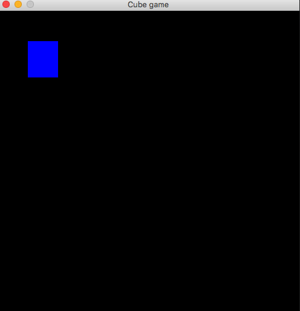

# Trump bullet game
A simple action game written in python.

[](https://travis-ci.org/vyahello/trump-bullet)

# Run a program
Run script from the root directory of the project:
```bash
python game.py
```

## Demo


## Run code analysis
From the root directory of your shell run next command
```bash
➜ ./code-analysis.sh
```
### Code analysis report
```bash
Running code analysis...
Installing python packages...
Requirement already satisfied: pygame in /Users/vyah/.pyenv/versions/3.6.5/envs/trump-bullet/lib/python3.6/site-packages (from -r requirements.txt (line 1)) (1.9.4)
Requirement already satisfied: pytest in /Users/vyah/.pyenv/versions/3.6.5/envs/trump-bullet/lib/python3.6/site-packages (from -r requirements.txt (line 2)) (4.3.1)
Requirement already satisfied: atomicwrites>=1.0 in /Users/vyah/.pyenv/versions/3.6.5/envs/trump-bullet/lib/python3.6/site-packages (from pytest->-r requirements.txt (line 2)) (1.3.0)
Requirement already satisfied: attrs>=17.4.0 in /Users/vyah/.pyenv/versions/3.6.5/envs/trump-bullet/lib/python3.6/site-packages (from pytest->-r requirements.txt (line 2)) (19.1.0)
Requirement already satisfied: more-itertools>=4.0.0; python_version > "2.7" in /Users/vyah/.pyenv/versions/3.6.5/envs/trump-bullet/lib/python3.6/site-packages (from pytest->-r requirements.txt (line 2)) (6.0.0)
Requirement already satisfied: six>=1.10.0 in /Users/vyah/.pyenv/versions/3.6.5/envs/trump-bullet/lib/python3.6/site-packages (from pytest->-r requirements.txt (line 2)) (1.12.0)
Requirement already satisfied: pluggy>=0.7 in /Users/vyah/.pyenv/versions/3.6.5/envs/trump-bullet/lib/python3.6/site-packages (from pytest->-r requirements.txt (line 2)) (0.9.0)
Requirement already satisfied: setuptools in /Users/vyah/.pyenv/versions/3.6.5/envs/trump-bullet/lib/python3.6/site-packages (from pytest->-r requirements.txt (line 2)) (39.0.1)
Requirement already satisfied: py>=1.5.0 in /Users/vyah/.pyenv/versions/3.6.5/envs/trump-bullet/lib/python3.6/site-packages (from pytest->-r requirements.txt (line 2)) (1.8.0)
Running unittests
====================================================================================================== test session starts ======================================================================================================
platform darwin -- Python 3.6.5, pytest-4.3.1, py-1.8.0, pluggy-0.9.0 -- /Users/vyah/.pyenv/versions/3.6.5/envs/trump-bullet/bin/python
cachedir: .pytest_cache
rootdir: /Users/vyah/files/myprojects/trump-bullet, inifile: pytest.ini
collected 25 items                                                                                                                                                                                                              

tests/model/test_navigation.py::test_count_navigation_options PASSED                                                                                                                                                      [  4%]
tests/model/test_navigation.py::test_navigation_option PASSED                                                                                                                                                             [  8%]
tests/model/test_navigation.py::test_contains_navigation[Navigation.up] PASSED                                                                                                                                            [ 12%]
tests/model/test_navigation.py::test_contains_navigation[Navigation.down] PASSED                                                                                                                                          [ 16%]
tests/model/test_navigation.py::test_contains_navigation[Navigation.left] PASSED                                                                                                                                          [ 20%]
tests/model/test_navigation.py::test_contains_navigation[Navigation.right] PASSED                                                                                                                                         [ 24%]
tests/model/test_navigation.py::test_contains_navigation[Navigation.quit] PASSED                                                                                                                                          [ 28%]
tests/model/test_properties.py::test_property_coordinates PASSED                                                                                                                                                          [ 32%]
tests/model/test_properties.py::test_color_as_rgba PASSED                                                                                                                                                                 [ 36%]
tests/model/test_properties.py::test_resolution_as_sequence PASSED                                                                                                                                                        [ 40%]
tests/model/test_properties.py::test_resolution_top_height PASSED                                                                                                                                                         [ 44%]
tests/model/test_properties.py::test_resolution_top_width PASSED                                                                                                                                                          [ 48%]
tests/model/test_properties.py::test_resolution_bottom_height PASSED                                                                                                                                                      [ 52%]
tests/model/test_properties.py::test_resolution_bottom_width PASSED                                                                                                                                                       [ 56%]
tests/model/test_properties.py::test_border_is_top_left PASSED                                                                                                                                                            [ 60%]
tests/model/test_properties.py::test_border_is_top_right PASSED                                                                                                                                                           [ 64%]
tests/model/test_properties.py::test_border_is_top_upper PASSED                                                                                                                                                           [ 68%]
tests/model/test_properties.py::test_border_is_top_lower PASSED                                                                                                                                                           [ 72%]
tests/model/test_properties.py::test_border_is_not_top_left PASSED                                                                                                                                                        [ 76%]
tests/model/test_properties.py::test_border_is_not_top_right PASSED                                                                                                                                                       [ 80%]
tests/model/test_properties.py::test_border_is_not_top_upper PASSED                                                                                                                                                       [ 84%]
tests/model/test_properties.py::test_border_is_not_top_lower PASSED                                                                                                                                                       [ 88%]
tests/model/test_shapes.py::test_get_rectangle_location PASSED                                                                                                                                                            [ 92%]
tests/model/test_shapes.py::test_set_rectangle_location PASSED                                                                                                                                                            [ 96%]
tests/model/test_visual.py::test_display_resolution PASSED                                                                                                                                                                [100%]

=================================================================================================== 25 passed in 0.18 seconds ===================================================================================================
removing .pytest_cache testing trash
environment is cleared
Code analysis is passed.
```

# Contributing

- clone the repository
- configure Git for the first time after cloning with your name and email
  ```bash
  git config --local user.name "Volodymyr Yahello"
  git config --local user.email "vyahello@gmail.com"
  ```
- `python3.6` is required to run the code