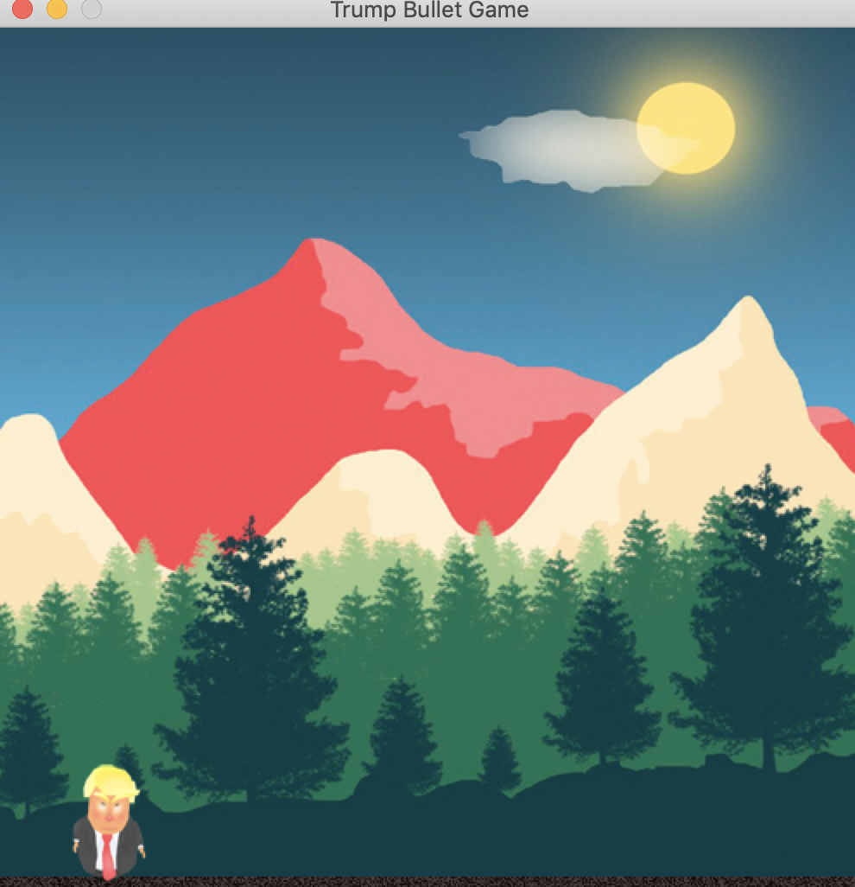

# Trump bullet game
A simple action game written in python.

[](https://travis-ci.org/vyahello/trump-bullet)

# Run a program
Run script from the root directory of the project:
```bash
python game.py
```

## Demo


## Run code analysis
From the root directory of your shell run next command
```bash
➜ ./code-analysis.sh
```
### Code analysis report
```bash
(trump-bullet) ➜  trump-bullet git:(master) ✗ ./code-analysis.sh
Running code analysis...
Removing __pycache__ directories if present...
Installing python packages...
Requirement already satisfied: pygame in /Users/vyah/.pyenv/versions/3.6.5/envs/trump-bullet/lib/python3.6/site-packages (from -r requirements.txt (line 1)) (1.9.4)
Requirement already satisfied: pytest in /Users/vyah/.pyenv/versions/3.6.5/envs/trump-bullet/lib/python3.6/site-packages (from -r requirements.txt (line 2)) (4.3.1)
Requirement already satisfied: setuptools in /Users/vyah/.pyenv/versions/3.6.5/envs/trump-bullet/lib/python3.6/site-packages (from pytest->-r requirements.txt (line 2)) (39.0.1)
Requirement already satisfied: atomicwrites>=1.0 in /Users/vyah/.pyenv/versions/3.6.5/envs/trump-bullet/lib/python3.6/site-packages (from pytest->-r requirements.txt (line 2)) (1.3.0)
Requirement already satisfied: pluggy>=0.7 in /Users/vyah/.pyenv/versions/3.6.5/envs/trump-bullet/lib/python3.6/site-packages (from pytest->-r requirements.txt (line 2)) (0.9.0)
Requirement already satisfied: attrs>=17.4.0 in /Users/vyah/.pyenv/versions/3.6.5/envs/trump-bullet/lib/python3.6/site-packages (from pytest->-r requirements.txt (line 2)) (19.1.0)
Requirement already satisfied: six>=1.10.0 in /Users/vyah/.pyenv/versions/3.6.5/envs/trump-bullet/lib/python3.6/site-packages (from pytest->-r requirements.txt (line 2)) (1.12.0)
Requirement already satisfied: more-itertools>=4.0.0; python_version > "2.7" in /Users/vyah/.pyenv/versions/3.6.5/envs/trump-bullet/lib/python3.6/site-packages (from pytest->-r requirements.txt (line 2)) (6.0.0)
Requirement already satisfied: py>=1.5.0 in /Users/vyah/.pyenv/versions/3.6.5/envs/trump-bullet/lib/python3.6/site-packages (from pytest->-r requirements.txt (line 2)) (1.8.0)
Running unittests...
===================================================================================== test session starts =====================================================================================
platform darwin -- Python 3.6.5, pytest-4.3.1, py-1.8.0, pluggy-0.9.0 -- /Users/vyah/.pyenv/versions/3.6.5/envs/trump-bullet/bin/python
cachedir: .pytest_cache
rootdir: /Users/vyah/files/myprojects/trump-bullet, inifile: pytest.ini
collected 54 items

tests/controller/test_system.py::test_system_images PASSED                                                                                                                              [  1%]
tests/controller/test_system.py::test_system_character PASSED                                                                                                                           [  3%]
tests/controller/test_system.py::test_system_clock PASSED                                                                                                                               [  5%]
tests/controller/test_system.py::test_system_empty_bullets PASSED                                                                                                                       [  7%]
tests/controller/test_system.py::test_system_is_run PASSED                                                                                                                              [  9%]
tests/controller/test_system.py::test_set_system_is_run PASSED                                                                                                                          [ 11%]
tests/controller/test_system.py::test_set_error_system_is_run PASSED                                                                                                                    [ 12%]
tests/controller/test_system.py::test_system_last_move PASSED                                                                                                                           [ 14%]
tests/controller/test_system.py::test_set_system_last_move PASSED                                                                                                                       [ 16%]
tests/controller/test_system.py::test_set_error_system_last_move PASSED                                                                                                                 [ 18%]
tests/model/test_bullet.py::test_bullet_velocity PASSED                                                                                                                                 [ 20%]
tests/model/test_bullet.py::test_bullet_axi_x PASSED                                                                                                                                    [ 22%]
tests/model/test_bullet.py::test_bullet_axi_y PASSED                                                                                                                                    [ 24%]
tests/model/test_bullet.py::test_set_bullet_axi_x PASSED                                                                                                                                [ 25%]
tests/model/test_bullet.py::test_set_bullet_axi_y PASSED                                                                                                                                [ 27%]
tests/model/test_bullet.py::test_set_error_bullet_axi_x PASSED                                                                                                                          [ 29%]
tests/model/test_bullet.py::test_set_error_bullet_axi_y PASSED                                                                                                                          [ 31%]
tests/model/test_character.py::test_is_move_left PASSED                                                                                                                                 [ 33%]
tests/model/test_character.py::test_is_move_right PASSED                                                                                                                                [ 35%]
tests/model/test_character.py::test_animation_count PASSED                                                                                                                              [ 37%]
tests/model/test_character.py::test_set_is_move_left PASSED                                                                                                                             [ 38%]
tests/model/test_character.py::test_set_is_move_right PASSED                                                                                                                            [ 40%]
tests/model/test_character.py::test_set_animation_count PASSED                                                                                                                          [ 42%]
tests/model/test_character.py::test_error_is_move_left PASSED                                                                                                                           [ 44%]
tests/model/test_character.py::test_error_is_move_right PASSED                                                                                                                          [ 46%]
tests/model/test_character.py::test_error_animation_count PASSED                                                                                                                        [ 48%]
tests/model/test_navigation.py::test_count_navigation_options PASSED                                                                                                                    [ 50%]
tests/model/test_navigation.py::test_navigation_option PASSED                                                                                                                           [ 51%]
tests/model/test_navigation.py::test_contains_navigation[Navigation.up] PASSED                                                                                                          [ 53%]
tests/model/test_navigation.py::test_contains_navigation[Navigation.down] PASSED                                                                                                        [ 55%]
tests/model/test_navigation.py::test_contains_navigation[Navigation.left0] PASSED                                                                                                       [ 57%]
tests/model/test_navigation.py::test_contains_navigation[Navigation.right] PASSED                                                                                                       [ 59%]
tests/model/test_navigation.py::test_contains_navigation[Navigation.quit] PASSED                                                                                                        [ 61%]
tests/model/test_navigation.py::test_contains_navigation[Navigation.left1] PASSED                                                                                                       [ 62%]
tests/model/test_navigation.py::test_contains_navigation[Navigation.f] PASSED                                                                                                           [ 64%]
tests/model/test_properties.py::test_property_coordinates PASSED                                                                                                                        [ 66%]
tests/model/test_properties.py::test_calculate_jumper PASSED                                                                                                                            [ 68%]
tests/model/test_properties.py::test_color_as_rgba PASSED                                                                                                                               [ 70%]
tests/model/test_properties.py::test_resolution_as_sequence PASSED                                                                                                                      [ 72%]
tests/model/test_properties.py::test_resolution_top_height PASSED                                                                                                                       [ 74%]
tests/model/test_properties.py::test_resolution_top_width PASSED                                                                                                                        [ 75%]
tests/model/test_properties.py::test_resolution_bottom PASSED                                                                                                                           [ 77%]
tests/model/test_properties.py::test_border_is_top_left PASSED                                                                                                                          [ 79%]
tests/model/test_properties.py::test_border_is_top_right PASSED                                                                                                                         [ 81%]
tests/model/test_properties.py::test_border_is_top_upper PASSED                                                                                                                         [ 83%]
tests/model/test_properties.py::test_border_is_top_lower PASSED                                                                                                                         [ 85%]
tests/model/test_properties.py::test_border_is_not_top_left PASSED                                                                                                                      [ 87%]
tests/model/test_properties.py::test_border_is_not_top_right PASSED                                                                                                                     [ 88%]
tests/model/test_properties.py::test_border_is_not_top_upper PASSED                                                                                                                     [ 90%]
tests/model/test_properties.py::test_border_is_not_top_lower PASSED                                                                                                                     [ 92%]
tests/model/test_properties.py::test_resolution_error PASSED                                                                                                                            [ 94%]
tests/model/test_shapes.py::test_get_rectangle_location PASSED                                                                                                                          [ 96%]
tests/model/test_shapes.py::test_set_rectangle_location PASSED                                                                                                                          [ 98%]
tests/model/test_visual.py::test_display_resolution PASSED                                                                                                                              [100%]

================================================================================== 54 passed in 0.37 seconds ==================================================================================
Removing pytest trash if present...
Environment is clean!
Code analysis is passed.
```

# Contributing

- clone the repository
- configure Git for the first time after cloning with your name and email
  ```bash
  git config --local user.name "Volodymyr Yahello"
  git config --local user.email "vyahello@gmail.com"
  ```
- `python3.6` is required to run the code